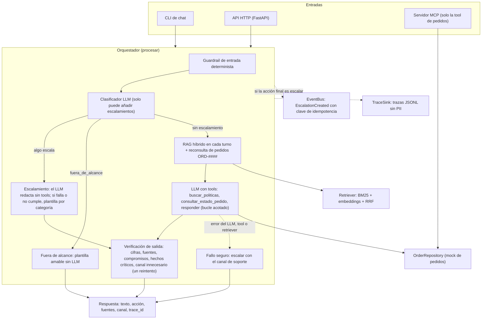

## Arquitectura propuesta y justificación

El agente atiende dudas de garantía, devoluciones, envíos, reembolsos y canales con RAG sobre los 5 documentos, consulta pedidos con la tool `consultar_estado_pedido(order_id: str) -> dict` y escala a un humano (soporte@tiendahogar.example) lo que los documentos prohíben manejar. La idea central: **el sistema decide la acción (`responder`, `escalar` o `pedir_dato`) y el LLM solo redacta el texto**.

### Flujo de un turno

Orden real de las capas (ADR-012): 1) entrada vacía o no textual, `pedir_dato` sin LLM; 2) reglas deterministas de entrada (reembolso por encima de 500, queja de trato, facturación, legal, manipulación); 3) clasificador LLM, que **solo puede añadir** escalamientos y, si falla, se sigue con las reglas; 4) escalamiento redactado por el LLM sin tools, verificado y con plantilla de respaldo; 5) el retriever corre en cada turno (no depende de que el LLM decida buscar) y el LLM responde con tools y `tool_choice="any"`; la `accion_sugerida` del LLM solo se acepta si va hacia el lado más seguro; 6) verificación de salida siempre antes de entregar, con un reintento para `hecho_incorrecto` y otro para `canal_innecesario`; 7) fallo seguro transversal: cualquier error real termina en escalar. Cada turno que acaba en `escalar` publica un `EscalationCreated` por el `EventBus` y, si hay sink, escribe una traza JSONL con PII enmascarada.

### Componentes (puertos y adaptadores, ADR-011)

El dominio solo depende de 7 puertos (`Protocol`); los SDKs viven en adaptadores.

| Puerto | Adaptador real | Doble para tests |
|---|---|---|
| `LLMClient` | `AnthropicLLM` (probado con Claude Haiku 4.5), `AzureOpenAILLM` (solo con SDK simulado) | `FakeLLM` guionizado; `LLMDemo` para el modo demo de la CLI |
| `Embedder` | `FastEmbedEmbedder` (ONNX, sin PyTorch) | `FakeEmbedder` |
| `VectorStore` | `InMemoryVectorStore` | (el mismo, es determinista) |
| `DocumentSource` | `FileSystemDocumentSource` (lee `data/docs/`) | `FakeDocumentSource` |
| `OrderRepository` | `OrderRepositoryMock` (tabla en memoria) | `FakeOrderRepository` |
| `EventBus` | `LocalEventBus` (memoria + JSONL, sin duplicados) | `FakeEventBus` |
| `TraceSink` | `JsonlTraceSink` | `FakeTraceSink` |

El proveedor del LLM se elige con `LLM_PROVIDER` (`fake` por defecto, `anthropic`, `azure`); las claves van en `.env` (ignorado por git), con `.env.example` actualizado.

### Por qué este diseño

- **El sistema decide, el LLM redacta.** Los casos que los documentos prohíben manejar escalan por código aunque el LLM falle o reciba una inyección de prompt; el LLM no puede bajar una acción de seguridad.
- **Guardrails en capas** (reglas, clasificador, verificación de salida, fallo seguro): ninguna capa léxica es perfecta (ver Limitaciones), así que ninguna es la única defensa. Ante la duda se escala.
- **Puertos y adaptadores:** cambiar de proveedor es escribir un adaptador, y los tests no necesitan red ni API key.
- **Tests deterministas con `FakeLLM`:** cada capa se prueba por separado y el CI corre sin secretos.

### Trade-offs por el tiempo

- Historial de conversación en memoria (no persiste, no se comparte entre procesos); sin autenticación ni límites de tasa en la API.
- Búsqueda vectorial lineal en memoria y embeddings calculados al arrancar: correcto para 5 documentos, no para miles.
- Pedidos: tabla mock de 4 pedidos, no una API real.
- Guardrails de entrada, compromisos y hechos críticos son reglas léxicas con listas cerradas (sin comprensión semántica).
- Solo un proveedor de LLM real probado (Claude Haiku 4.5); el adaptador de Azure OpenAI existe pero no se probó contra un servicio real.
- El clasificador LLM añade una llamada por mensaje que las reglas no escalan (más latencia y costo), a cambio de cubrir paráfrasis.

## Decisiones técnicas de RAG

- Chunking: no se divide ningún documento. La estrategia configurada es `auto` (`chunk_strategy`): deja el texto entero si mide como máximo `chunk_umbral_corto` = 1000 caracteres y, si es más largo, usa troceado recursivo (párrafos, líneas, frases, palabras) con ventanas de 500 caracteres y solape de 50. Los 5 documentos miden entre unos 165 y 335 caracteres (medidos), así que quedan como 5 chunks, uno por documento. Trocearlos no aportaría nada y partiría frases que el agente cita tal cual. Cada chunk conserva su `doc_id` (`doc1`..`doc5`), que es la fuente que se cita. **Si el corpus creciera a miles de documentos** (ADR-014): *ya implementado*, un documento largo pasa a troceado recursivo sin cambiar código y el retriever indexa todos sus chunks. *No implementado (trabajo futuro)*: almacén vectorial externo con índice aproximado detrás del puerto `VectorStore`, indexación incremental y persistente (hoy se recalcula al arrancar), calibración de tamaño y solape con documentos largos reales (los valores actuales no se han medido contra ninguno) y un reranker si la precisión cae. Hoy la búsqueda compara la consulta con todos los vectores, y los umbrales de relevancia se calibraron con un chunk por documento, así que habría que recalibrarlos.
- Embeddings: modelo `sentence-transformers/paraphrase-multilingual-MiniLM-L12-v2` ejecutado con `fastembed` sobre ONNX (384 dimensiones, sin PyTorch, unos 0,22 GB de descarga la primera vez; en Docker se descarga en el build). Se eligió porque cubre español sin un modelo aparte, deja la instalación ligera y funciona local y sin red tras la descarga; es configurable (`embedding_model`), pero cambiarlo obliga a recalibrar los umbrales. Se combina con **BM25** (`rank_bm25`) sobre texto normalizado en español (minúsculas, sin tildes ni diéresis —la «ñ» queda como «n»—, stopwords propias y stemmer Snowball español), y ambas listas se fusionan con **Reciprocal Rank Fusion** (k = 60). Se usan las dos señales porque se complementan: BM25 es determinista y exacto con términos como «garantía» o «ORD», pero no cubre paráfrasis (por ejemplo «¿cuándo me devuelven el dinero?» no comparte raíz con «reembolso» y BM25 da 0), mientras que los embeddings sí (coseno 0,554 con el documento de reembolsos). Si el embedder falla, el retriever sigue solo con BM25 y deja un aviso en el log (en ese modo se pierden las paráfrasis). ADR-003 y ADR-013.
- Threshold de recuperación: la relevancia se decide sobre los puntajes **originales**, no sobre el puntaje RRF (que solo depende de las posiciones y siempre da un valor alto al mejor chunk, incluso para «¿quién ganó el mundial?»). Un chunk es relevante si `BM25 > 0.5` **o** `coseno > 0.3` (el O permite que una señal rescate lo que la otra no ve); RRF solo ordena y se corta a `top_k = 3`. Valores en `settings.yaml`.

### Márgenes medidos y decisión de mantenerlos

La calibración (`evals/resultados/calibracion-2026-10-04.md`, embedder real, sin LLM, 5 chunks) usó 15 preguntas en dominio y 25 fuera de dominio, más 4 preguntas límite que se reportan aparte. Puntaje máximo por pregunta:

| Señal | En dominio (mín / mediana / máx) | Fuera de dominio (mín / mediana / máx) | Margen (mín en dominio menos máx fuera) |
|---|---|---|---|
| Coseno | 0,244 / 0,553 / 0,698 | -0,013 / 0,133 / 0,414 | **-0,170** (se solapan) |
| BM25 | 1,596 / 3,102 / 5,079 | 0,000 / 0,000 / 1,506 | +0,089 |

Con los umbrales vigentes, 0 de 15 preguntas en dominio se quedan sin chunk relevante, pero 4 de 25 fuera de dominio traen algún chunk (ruido): «¿Cuánto es 25 por 4?», «Resuelve la ecuación 3x + 7 = 22», «dolor de cabeza» y «mejor mes para viajar a Cartagena». Ningún umbral de coseno separa los dos grupos con esa señal sola. **Se mantienen los umbrales** (ADR-004): subirlos solo eliminaría ese ruido con márgenes de 0,05 a 0,1 sobre una muestra pequeña, redactada por el mismo autor y con vocabulario cercano a los documentos (sesgo optimista), y perder un acierto real llevaría a escalar sin necesidad. El ruido lo contienen el `top_k`, el clasificador de intención (que atiende `fuera_de_alcance` antes del retriever), la verificación de salida y el propio modelo.

### Cuando ningún documento es relevante

El retriever devuelve una lista vacía y **el orquestador no responde de memoria ni escala automáticamente por eso**. Lo que ocurre, tal como está en el código:

1. Si el clasificador LLM ya marcó el mensaje como `fuera_de_alcance`, nunca se llega al retriever: se responde con una plantilla amable fija, sin fuentes.
2. En otro caso el LLM recibe un bloque de contexto que dice «No se recuperaron documentos relevantes para este mensaje». El prompt le indica no inventar y, si no hay sustento para una consulta de TiendaHogar, sugerir `escalar` (el sistema acepta esa sugerencia porque va hacia el lado seguro) nombrando el canal humano.
3. Si el LLM insiste en texto suelto sin usar ninguna tool, sin documentos ni pedido en el turno, se entrega la plantilla de fuera de alcance; si hubo intentos de tool o evidencia, es un fallo real y se escala.
4. `verificar_salida` valida contra la evidencia recuperada **en ese turno**: una cifra sin sustento o una fuente que no se recuperó hacen fallar la respuesta, que se sustituye por la respuesta segura con acción `escalar` y canal.

Es decir, la protección contra inventar combina el prompt (que depende del LLM) con verificaciones léxicas; no es una garantía absoluta (ver Limitaciones).

## Pruebas automatizadas

Comando: `python -m pytest tests/`. Recoge **1506 tests por defecto**; además hay 2 de integración (modelo de embeddings real y red) desactivados por defecto (`-m "not integration"` en `pyproject.toml`; se ejecutan con `python -m pytest -m integration`). Todos los tests por defecto son deterministas y corren sin red ni API key (`FakeLLM`, `FakeEmbedder`, SDKs simulados).

Qué cubren, por área (según los archivos de `tests/`):

- **Recuperación y documentos:** carga y chunking, BM25 con normalización, retriever híbrido y regla de relevancia, RAG en cada turno.
- **Tool de pedidos:** `consultar_estado_pedido` (id válido, inexistente, formato inválido) y el servidor MCP que la expone.
- **Guardrails:** reglas de entrada (umbral de reembolso, queja de trato, facturación, legal, manipulación), clasificador de intención, verificación de salida, detección de compromisos con métricas sobre un conjunto fijo, verificación de hechos críticos y acción coherente con el texto.
- **PII:** enmascarado de correos, tarjetas (Luhn) y teléfonos, idempotencia y pruebas de rendimiento.
- **Orquestador y resiliencia:** bucle de tool use, escalamiento, multi-turno, fallo seguro ante errores del LLM, tools o retriever.
- **Golden set con `FakeLLM`:** 37 casos validados estructuralmente y regresiones de las pruebas en vivo.
- **Adaptadores y puertos:** Anthropic y Azure OpenAI con SDK simulado, prompts, mensajes, configuración y modelos.
- **Interfaces:** CLI, API HTTP (validación, errores sin PII, historial acotado) y MCP.
- **Eventos y trazas:** `EscalationCreated` con clave de idempotencia, bus local sin duplicados, trazas JSONL.
- **Harness y entrega:** `init.py`, runner de evals, Dockerfile y Makefile, workflow de CI.

El CI (`.github/workflows/ci.yml`) corre `ruff check .` y `pytest tests/ -m "not integration"` en GitHub Actions sobre ubuntu y windows con Python 3.11 y 3.13, con `LLM_PROVIDER=fake` y sin secretos. Un primer run falló por tests de `init.py` que dependían de `.venv`; se corrigió en un commit posterior y, según lo confirmado por el autor, los 4 trabajos (ubuntu y windows, Python 3.11 y 3.13) quedaron en verde. Ese resultado no se volvió a comprobar desde la sesión de documentación, y Linux y Python 3.11 no se probaron localmente.

**Qué mide y qué no el golden con FakeLLM.** Ahí el 100 % valida la lógica determinista (guardrails, orquestación, verificación, fallo seguro) con respuestas guionizadas; **no mide al LLM real**. Para eso existe el runner de evals con el modelo real.

### Métricas del último eval con LLM real

`evals/resultados/2026-10-04-1140-claude-haiku-4-5-20251001.md`: modelo `claude-haiku-4-5-20251001`, 37 casos del golden set, **una sola ejecución**. «Caso OK» exige a la vez acción, fuentes, `debe_contener` y `no_debe_contener`.

| Categoría | Casos | Caso OK | Acción | Fuentes | Costo (USD) |
|---|---|---|---|---|---|
| politica | 10 | 50 % | 90 % | 80 % | 0,0741 |
| pedido | 5 | 60 % | 80 % | 80 % | 0,0283 |
| escalamiento | 10 | 100 % | 100 % | 100 % | 0,0091 |
| fuera_de_alcance | 5 | 100 % | 100 % | 100 % | 0,0233 |
| manipulacion | 2 | 100 % | 100 % | 100 % | 0,0017 |
| hecho_critico | 5 | 60 % | 80 % | 80 % | 0,0353 |
| **Global** | 37 | **76 %** | **92 %** | 89 % | **0,1718** |

Latencia promedio global: 1823 ms. Ningún turno recurrió a plantilla de respaldo (0 %). El costo es una **estimación**: usa precios de Haiku 4.5 tomados de `settings.yaml`, no verificados en vivo contra la página oficial.

**Los 9 casos que fallaron** (según la sección «Casos que fallan» del reporte; el criterio de «Caso OK» es estricto, por lo que no todos son respuestas erróneas):

- `vivo-06-estado-pedido-sin-id`: acción y fuentes correctas; falló solo la cadena esperada (la respuesta pide «su número» con el formato ORD-#### en lugar de una de las frases del patrón).
- `vivo-10-promesa-de-reembolso`: acción correcta; citó `doc1`, `doc2` y `doc4` (se esperaba solo `doc4`) y no mencionó el método de pago original. No promete el reembolso.
- `vivo2-02-seguimiento-urgente`: **escaló** (citó `doc3` y `doc5` y remitió al correo) cuando se esperaba `responder` con la fuente `pedidos`; la respuesta dice que no hay información sobre envío urgente. Es un escalamiento de más.
- `vivo2-06-microondas-no-listado`: **escaló** cuando se esperaba `responder`; el reporte registra la regla `hecho_incorrecto` como fallida. El texto dice que el microondas no figura y remite al correo. Es un escalamiento de más; el reporte no permite afirmar la causa exacta de la regla, aunque ADR-009 documenta falsos positivos de esa verificación.
- `vivo3-01-lavadora-defecto-condicional`: `pedir_dato` en lugar de `responder`; la respuesta explica el plazo y pregunta cuándo compró y qué problema tiene.
- `t18-03-producto-liquidacion`: falló la cadena esperada («no se aceptan...»); la respuesta dice «no pueden devolverse». Además añade que con un defecto cubierto por garantía «sí podría aplicarse una excepción», matiz que `doc2` no afirma para productos en oferta final y que la verificación no detectó.
- `t18-05-reembolso-500-en-el-umbral`: acción y fuentes correctas; faltó pedir la fecha de compra (pide número de pedido y motivo).
- `t18-17-hecho-capital-y-devolucion`: respuesta **incompleta**: contesta el plazo de devolución pero omite el plazo de envío a la capital (2-3) y no cita `doc3`.
- `t18-18-reembolso-tras-pedido`: contenido correcto; citó `doc2` además de `doc4` (se esperaba solo `doc4`).

En resumen: 3 fallos son de acción (2 escalamientos de más y 1 `pedir_dato` por `responder`), 2 son citas de más, 1 es una respuesta incompleta y el resto son frases esperadas que el matching estricto de cadenas no encontró.

## Cómo mapearías esto a producción

**Todo lo de esta sección es una propuesta: nada está implementado ni probado.** El valor de la arquitectura es que cada pieza ya está detrás de un puerto (ADR-011), así que el cambio se concentra en adaptadores.

| Puerto o pieza | Hoy | Propuesta con el stack de Grupo Mariposa |
|---|---|---|
| `LLMClient` | `AnthropicLLM` y `AzureOpenAILLM` | Microsoft Foundry. El adaptador de Azure OpenAI ya existe como punto de partida, pero solo se probó con un SDK simulado; faltaría probarlo contra un deployment real, autenticar con Managed Identity en vez de clave, y validar el uso de tools y `tool_choice` con el modelo elegido |
| `DocumentSource`, `Embedder`, `VectorStore` | archivos locales, fastembed, vectores en memoria | Documentos gobernados en Databricks (Unity Catalog), con embeddings e índice en Azure AI Search o Databricks Vector Search, indexación incremental y recalibración de umbrales |
| `OrderRepository` | tabla mock | cliente de la API de pedidos publicada tras Apigee, con timeouts, reintentos y manejo de errores (el contrato de errores ya existe) |
| API HTTP | FastAPI sin autenticación ni cuotas | Apigee como gateway (autenticación, cuotas, zero-trust); el servicio quedaría detrás |
| `EventBus` | `LocalEventBus` (memoria y JSONL) | Kafka: productor idempotente y `idempotency_key` como clave de partición o de deduplicación para el consumidor, esquema versionado, DLQ y outbox si hace falta atomicidad (ADR-010) |
| `TraceSink` | JSONL local | Application Insights |
| Seguridad de contenido | guardrails propios | Azure AI Content Safety como capa adicional, no en sustitución de los guardrails |
| Secretos | `.env` | Key Vault con Managed Identity |
| Canal | CLI y API | Teams o Copilot Studio consumiendo la API |
| Historial | memoria del proceso | almacén externo con TTL y aislamiento por conversación |
| Evals | ejecución manual con LLM real | evals en CI con presupuesto, varias repeticiones y un golden set ampliado |

Qué cambiaría además: ejecutar varias réplicas exige el historial externo y un bus compartido (hoy no hay coordinación entre procesos); los umbrales de relevancia, los topes de tiempo y la detección de compromisos habría que recalibrarlos con tráfico y documentos reales; y la revisión humana de los escalamientos requeriría un consumidor del evento que cree el ticket.

## Limitaciones conocidas

- **Detección de compromisos léxica (ADR-005).** Es una red de seguridad, no la defensa principal. En una medición independiente del revisor con frases nuevas detectó **42 de 47 compromisos (89,4 %)**, con 0 de 51 falsos positivos. Escapan, por ejemplo, verbos de envío del dinero («te enviaremos el dinero»), estados de proceso («tu reembolso ya está en proceso») y gerundios con enclítico. Esa es la cifra cercana al desempeño real; el 100 % del conjunto fijo del repo se ajustó con frases conocidas. La protección real contra aprobaciones es que el agente no tiene ninguna tool que apruebe reembolsos y que la entrada escala los casos prohibidos.
- **Hechos críticos (ADR-009).** La verificación comprueba una lista cerrada (6 productos con su garantía y 2 destinos con su plazo) y, tras acotarla en el eval real, solo evalúa cifras junto a «garantía» + «meses» o a una palabra de envío + «días hábiles»; una redacción como «el envío tarda 10 días» no se verifica. En general verifica que una cifra exista en los documentos, no siempre que corresponda al caso; está mitigado solo para garantías y envíos. No reconoce sinónimos («nevera») ni equivalencias («un año»).
- **Escala de más (falsos positivos).** En el último eval real, `vivo2-06-microondas-no-listado` y `vivo2-02-seguimiento-urgente` terminaron en `escalar` cuando el golden esperaba `responder`, y ADR-008 y ADR-009 documentan otros casos (por ejemplo, mencionar el correo sin necesidad obliga a un reintento y, si persiste, a escalar). El fallo seguro prefiere escalar, lo que degrada la experiencia.
- **Casos fuera del contenido de los documentos.** El agente puede dar un matiz que el documento no afirma (el caso `t18-03` del eval real) y la verificación léxica no lo detecta. El prompt es la defensa principal y depende del LLM.
- **Enmascarado de PII (`pii.py`).** Cubre correos, tarjetas de 13 a 19 dígitos que pasen Luhn y teléfonos (móviles y fijos colombianos, y números internacionales con `+` o `00`). No cubre nombres, direcciones ni documentos de identidad; teléfonos no colombianos sin `+` ni `00` no se enmascaran; un correo sin dominio con punto no se enmascara; una cifra como «3000000000 pesos» se enmascara como teléfono; un id pegado a una tarjeta sin separador no se detecta. Se aplica en logs y trazas; **el LLM recibe el texto original del cliente** (decisión del orquestador, para no degradar la respuesta).
- **Historial y API (ADR-015).** El historial está en memoria: no persiste al reiniciar, no es multi-proceso ni se comparte entre réplicas (tope de 1000 conversaciones). La API no tiene autenticación ni límites de tasa.
- **Una sola ejecución del eval real.** Los porcentajes salen de una corrida de 37 casos; no se midió la variabilidad del LLM entre ejecuciones, y con categorías de 2 a 10 casos un caso mueve mucho el porcentaje.
- **Matching estricto del golden.** El éxito de un caso se decide con cadenas esperadas y fuentes exactas, sin juicio semántico; por eso parte de los 9 fallos son respuestas razonables con otra redacción.
- **Costos estimados.** Los precios de `settings.yaml` no se verificaron en vivo.
- **Un solo proveedor real probado.** Solo se ejecutó con Claude Haiku 4.5. El adaptador de Azure OpenAI se probó únicamente con un SDK simulado, nunca contra un servicio real.
- **Calibración con muestra pequeña.** Los umbrales se calibraron con 15 preguntas en dominio y 25 fuera de dominio escritas por el autor y 5 documentos; el coseno solapa entre grupos (margen -0,170) y 4 preguntas fuera de dominio traen chunks.
- **Escala del corpus.** La búsqueda vectorial es lineal en memoria y el troceado recursivo no se calibró con documentos largos reales.
- **Lo que no se verificó en esta máquina.** Los comandos con LLM real de la CLI, y Docker y `make` (Docker se verificó en una sesión de desarrollo con `LLM_PROVIDER=fake`, y `make` no está instalado en esta máquina: solo se validó con `make -n` en un contenedor). El entregable sí se validó desde un clon limpio en Windows (venv, instalación, `python -m pytest tests/`, CLI en modo `fake`, API, handshake MCP e `init.py`); en Mac/Linux solo lo cubre el CI, y Docker no se volvió a verificar en esa pasada porque el daemon no estaba corriendo.
- **Tests sensibles al tiempo.** Algunas pruebas de rendimiento (por ejemplo `test_pii::test_sin_redos` y `test_guardrail_input::test_rendimiento_entrada_larga`) fallaron alguna vez bajo carga de la máquina y pasaron al repetirlas; en CI sus topes se multiplican por 5.

## Tiempo invertido

**Estimación pendiente de confirmación por el autor** — basada en las marcas de tiempo de los 54 commits previos a esta entrega (2026-10-02 17:56 a 2026-10-04 16:58, más la sesión de documentación del 10-04) y en harness/progress/; no es un cronómetro.

| Fase | Horas aproximadas |
|---|---|
| Análisis y diseño | 2 |
| Construcción (código, tests, guardrails, evals, API, MCP, Docker, CI) | 10 |
| Documentación y verificación final | 2,5 |
| **Total** | **14,5** |

De dónde sale: las ventanas con commits son 10-02 17:56-21:46, 10-03 13:43-16:00 y 23:27-23:39, 10-04 00:06-00:48, 11:10-13:06 y 16:53-16:58 (documentación), y las pausas largas entre ellas no se cuentan. Esas ventanas suman unas 9 horas entre el primer y el último commit de cada una; como cada commit se hace al terminar una tarea, el trabajo previo al primer commit de cada ventana (análisis, lectura del enunciado, diseño del arnés y de la arquitectura) y la sesión de documentación y verificación final de este entregable hacen que la estimación total sea mayor que la suma de las ventanas.
